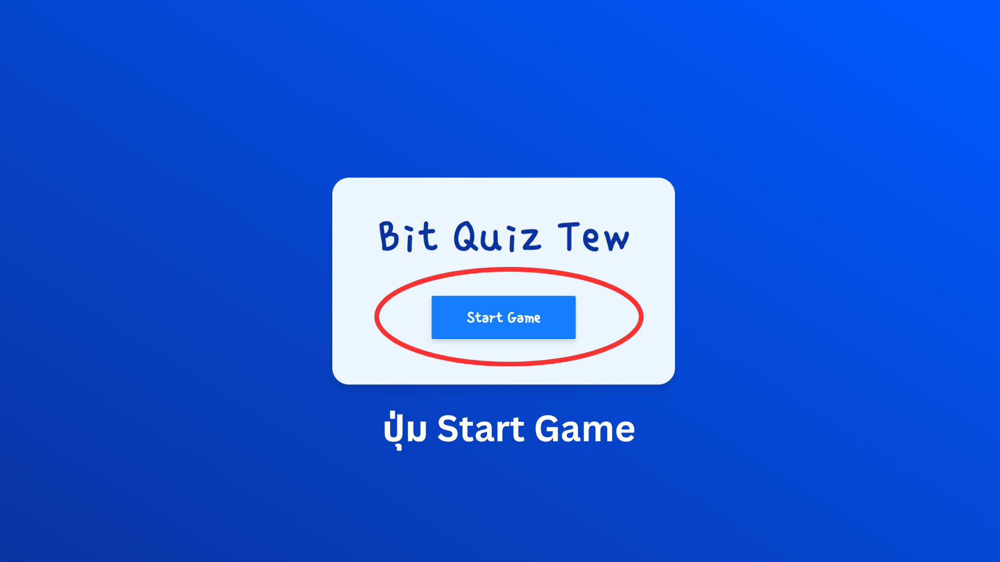
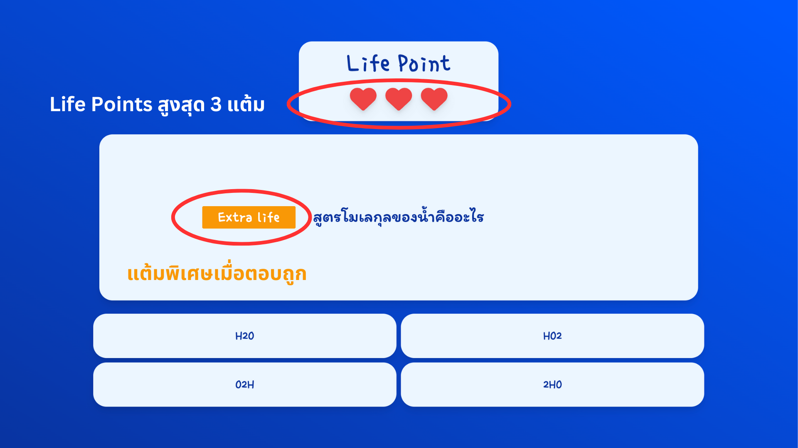
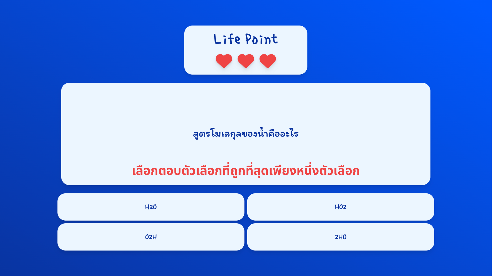
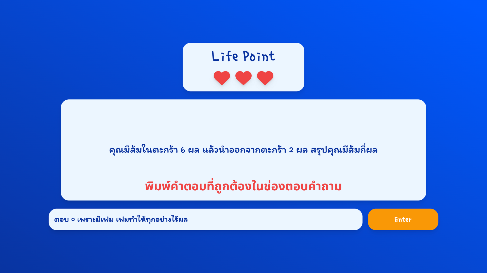
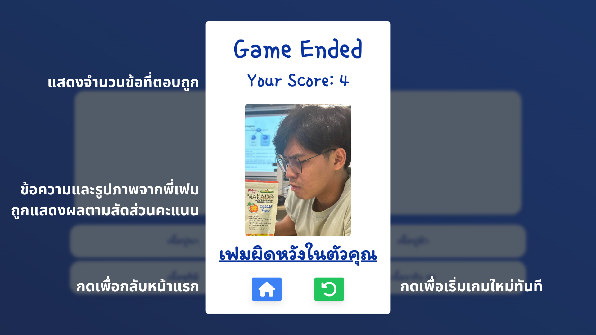

# PROJECT1-SEC-2-bit.ac.th.tew

## สมาชิก

### 1. 65130500066	นายภูวเมศฐ์ ปัญจเฉลิมรัตน์
### 2. 65130500083	นายสรวิชญ์ เครือคำ
### 3. 65130500093	นายกิตติพัฒน์ บัวลอยลม
### 4. 65130500100	นายชินภัทร โลหแสงสุวรรณ
### 5. 65130500106	นายธีรธร เที่ยงธรรม 
<hr>

## หน้าที่ความรับผิดชอบ
### 65130500066 นายภูวเมศฐ์ ปัญจเฉลิมรัตน์ (20 %)
- UX/UI appilcation.
- Style CSS and DaisyUI.
- Handle Event.
- Structure of template.
- Text validation function.

### 65130500083 นายสรวิชญ์ เครือคำ (20 %)
- Option validation function.
- Set style button effect.
- Optimize code
- Refactor code to module.

### 65130500093 นายกิตติพัฒน์ บัวลอยลม (20 %)
- Initial project.
- Question data.
- Result page.
- Ratio score for output spatial picture.

### 65130500100 นายชินภัทร โลหแสงสุวรรณ (20 %)
- Main menu page.
- Provide skeleton code.
- Initial state and action variable.
- Sorting question function.
- Optimize code.

### 65130500106 นายธีรธร เที่ยงธรรม (20 %)
- Quiz page.
- Handle Event.
- Question output.
- Structure of template.
<hr>

## รายการฟีเจอร์ความสามารถของแอปพลิเคชัน 
เป็น Quiz Application ที่ให้ User สามารถเข้ามาเล่นตอบคำถามได้โดยจะประกอบไปด้วย 
* Start Page หน้าเริ่มต้นก่อนเข้าไปเล่น Quiz
* Quiz Section หน้าของคำถาม
  * Question ส่วนของคำถาม
  * Answer มี 2 รูปแบบ 
    * รูปแบบตัวเลือกที่สามารถเลือกกดคำตอบได้ 1 คำตอบ
    * รูปแบบพิมพ์ตอบ
  * Life Point มีสูงสุด 3 Life Point ซึ่งลดลงทุกครั้งเมื่อตอบผิด 
    * Extra Life Point ในคำถามที่เมื่อตอบถูกจะเพิ่ม Life Point ให้
* Result Modal ที่แสดงขึ้นเมื่อตอบคำถามหมดหรือ Life Point เท่ากับ 0 
  * จำนวนข้อที่ถูกต้อง
  * รูปภาพ
  * Button
    * สำหรับกลับไปที่หน้า Start Page
    * สำหรับ Restart เริ่ม Quiz Section ใหม่
<hr>

## คู่มือการใช้งานแอปพลิเคชัน


### Main menu:
- กดปุ่ม Start Game เพื่อเริ่มเล่นเกม
- คำถามจะถูกสุ่มลำดับใหม่ทุกครั้งก่อนเริ่มเกม

### Quiz page:


### Life Points (แต้มชีวิต)
- Life points คือ จำนวนชีวิตของผู้เล่น (สูงสุด 3 แต้ม) หากผู้เล่นตอบคำถามผิด Life points จะลดลงหนึ่งแต้ม
- หาก Life points หมด Pop-up จบเกมจะถูกแสดง
- ทุก ๆ 5 ข้อ ถ้าผู้เล่นสามารถตอบคำถามได้ถูกต้อง Life points จะเพิ่มขึ้นหนึ่งแต้ม

### Answering (การตอบคำถาม)

- เลือกตอบตัวเลือกที่ถูกที่สุดเพียงหนึ่งตัวเลือก


- พิมพ์คำตอบที่ถูกต้องในช่องตอบคำถาม (case insensitive)
- หากพิมพ์คำตอบเกิน จะไม่นับว่าถูกต้อง เช่น คำตอบที่ถูกต้องคือ `เฟม` แต่คำตอบถูกที่ใส่มาคือ `เฟม ไง`

## Result Modal:

- แสดงจำนวนข้อที่ตอบถูกทั้งหมดของผู้เล่น
- ข้อความและรูปภาพจากพี่เฟมถูกแสดงผลตามสัดส่วนคะแนนของผู้เล่น
- ปุ่ม back to main menu (กดเพื่อกลับหน้าแรก) และ restart game (กดเพื่อเริ่มเกมใหม่ทันที)
<hr>

- # คลิปสาธิต features ของแอปพลิเคชัน
https://drive.google.com/file/d/18D_AY7UqAdYLecF9V4-1Ke-vQycFX_-k/view
<hr>

- # แหล่งข้อมูลอ้างอิงหรือเป็นแรงบันดาลใจในการพัฒนาแอปพลิเคชัน ให้ระบุให้ชัดเจนว่าแต่ละแหล่งอ้างอิงใช้ตรงส่วนใดของแอปพลิเคชัน
```
watch([() => state.score, () => state.lifePoints], async () => {  
  if (state.gameStatus === GameStatus.VALIDATED && !state.gameEnded) {
    await new Promise((resolve) => {
      setTimeout(() => {
        resolve();
        actions.nextQuiz();
      }, 1000);
    });
    await nextTick();
```

await / async
[https://borntodev.com/2020/03/06/%E0%B9%80%E0%B8%82%E0%B9%89%E0%B8%B2%E0%B9%83%E0%B8%88-await-async-%E0%B9%83%E0%B8%99-5-%E0%B8%99%E0%B8%B2%E0%B8%97%E0%B8%B5/](url)

Promise
[https://developer.mozilla.org/en-US/docs/Web/JavaScript/Reference/Global_Objects/Promise](url)

```
const newEvent = new Event('keyup');
event.target.previousElementSibling.dispatchEvent(newEvent);
```
dispatchEvent
https://developer.mozilla.org/en-US/docs/Web/API/EventTarget/dispatchEvent

```
const buttonStyles = Object.freeze({
  DEFAULT: btnStyleCss,
  CORRECT: btnStyleCss + ' bg-green-600 hover:bg-green-700 text-white',
  INCORRECT: btnStyleCss + ' bg-red-600 hover:bg-red-700 text-white',
});
```

Object.Freeze
[https://developer.mozilla.org/en-US/docs/Web/JavaScript/Reference/Global_Objects/Object/freeze](url)
[https://www.geeksforgeeks.org/javascript-object-freeze-method/](url)

<hr>
